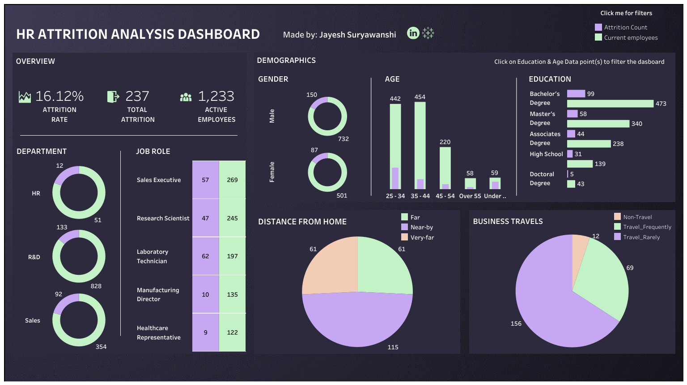

# HR Attrition Analysis  

• This is personal project that I completed a while back.
• It contains a detailed analysis of a dataset that consisted of demographic information about employees such as their age, gender, education and other information such as their job role, department, wages, performance rating work hours, training time required, etc. Alongside these, there is also survey data providing information on their job, relationship, environment satisfaction, work life balance, etc.

Tools Used: PostgreSQL (Data Analysis), Tableau (Data Visualization)

• The data was initially prepared, cleaned and transformed to make it ready for analysis
• Both the cleaned and unclean datasets are included in this repository. 

### Note: I have created a dashboard in tableau to view these findings at a glance and filter them out based on different data points.  
### I have attached an image of the dashboard below OR you can click here to view the Dashboard: [HR Attrition Analysis dashboard](https://public.tableau.com/app/profile/jayesh25/viz/HRAttritionAnalysis_16866548755520/Dashboard1)  

